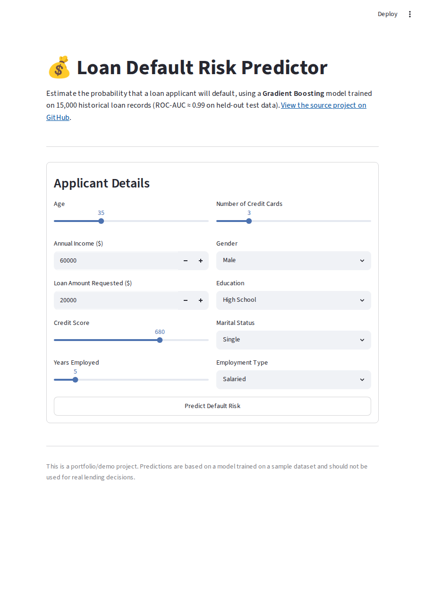
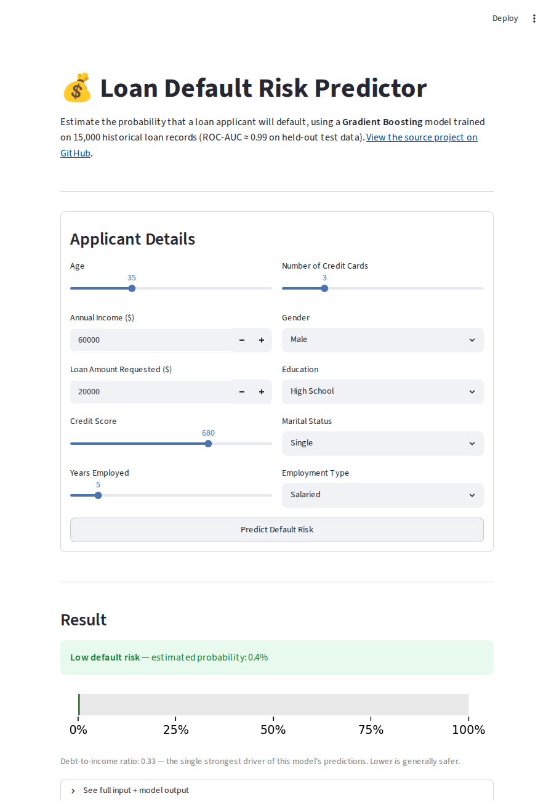
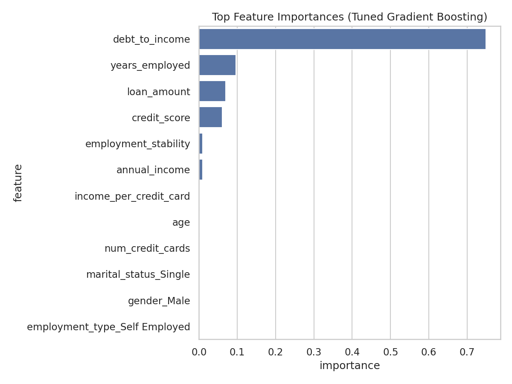
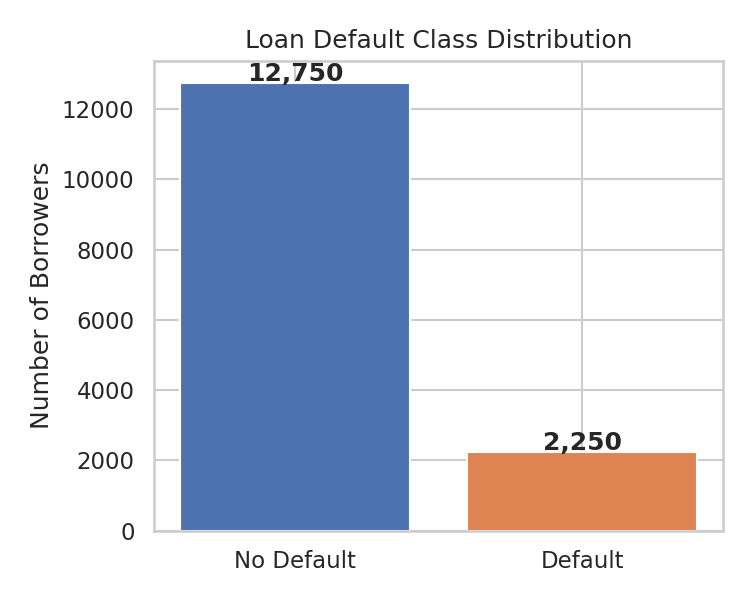
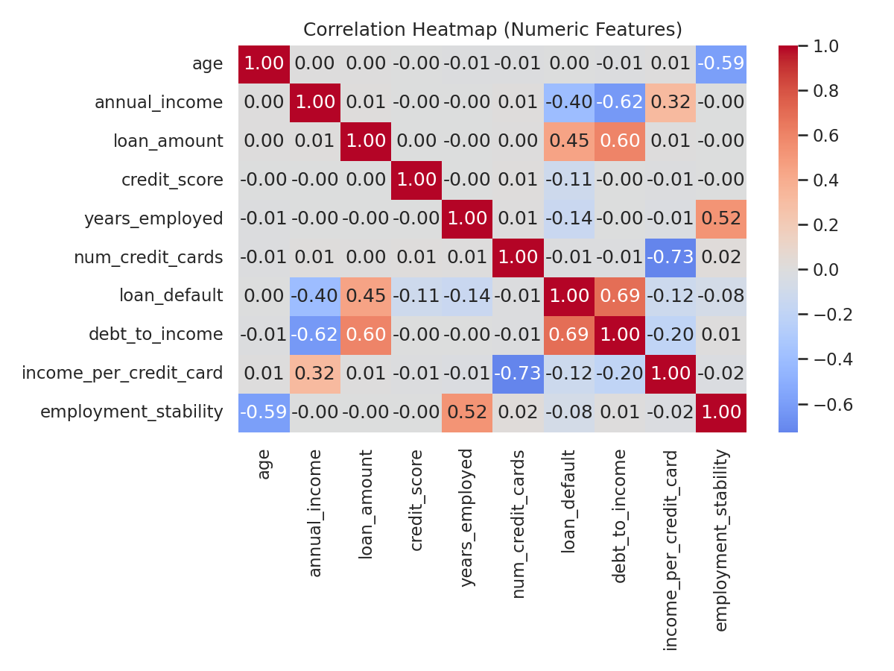
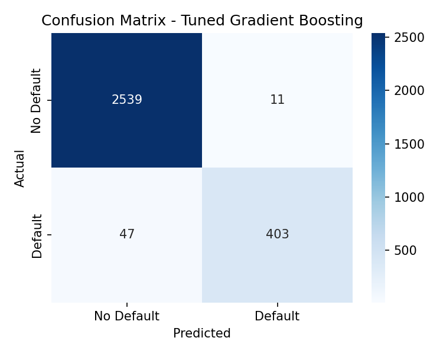
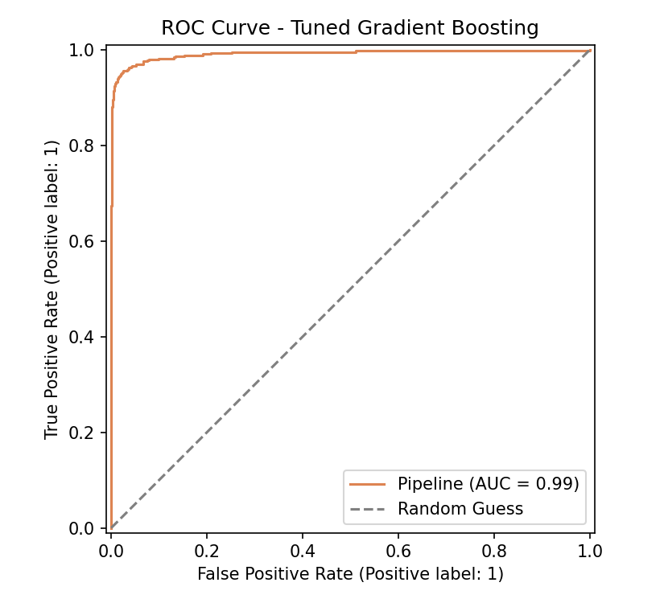

# Loan Default Prediction

A machine learning pipeline that predicts the probability of a borrower
defaulting on a loan, using demographic, financial, and employment data.
Built end-to-end: EDA → feature engineering → model comparison →
hyperparameter tuning → evaluation → reusable inference pipeline.


## Live Demo

[**Try the interactive demo →**](https://your-app-name.streamlit.app)
*(replace with your Streamlit Community Cloud URL after deploying — see [Deploying the Demo](#deploying-the-demo) below)*

<table>
<tr>
<td></td>
<td></td>
</tr>
</table>

## Results at a Glance

| Model | ROC-AUC | F1 Score | Precision | Recall |
|---|---|---|---|---|
| Logistic Regression | 0.986 | 0.867 | 0.792 | 0.958 |
| Random Forest | 0.987 | 0.902 | 0.965 | 0.847 |
| Gradient Boosting (baseline) | 0.992 | 0.931 | 0.967 | 0.898 |
| **Gradient Boosting (tuned)** | **0.992** | **0.933** | **0.973** | **0.896** |

The final tuned model correctly identifies **89.6% of borrowers who default**
while keeping false positives low (97.3% precision), on a held-out test set
of 3,000 borrowers.

## Problem

Lenders need to estimate default risk *before* approving a loan. This
project frames that as a binary classification problem: given an applicant's
age, income, requested loan amount, credit score, employment history, and
demographics, predict whether they will default.

The dataset contains 15,000 historical loan records with a 15% default rate
— a realistic class imbalance that the modeling pipeline explicitly accounts
for (`class_weight="balanced"`, ROC-AUC/F1 over raw accuracy).

## Key Insight



The single strongest predictor isn't any raw column — it's an **engineered
feature**: `debt_to_income` (loan amount ÷ annual income). This mirrors how
real underwriters assess risk and demonstrates the value of domain-informed
feature engineering over feeding raw fields into a model.

## Exploratory Data Analysis

<table>
<tr>
<td></td>
<td></td>
</tr>
</table>

Defaulters tend to have **lower credit scores**, **shorter employment
tenure**, and **higher loan-to-income ratios**. See
[`numeric_distributions.png`](images/numeric_distributions.png) and
[`categorical_default_rates.png`](images/categorical_default_rates.png) for
the full breakdown by feature and by demographic group.

## Model Evaluation

<table>
<tr>
<td></td>
<td></td>
</tr>
</table>

## Project Structure

```
loan-default-prediction/
├── data/
│   └── cleaned_loan_default_data.csv   # 15,000 loan records
├── notebooks/
│   └── loan_default_analysis.ipynb     # full EDA-to-model narrative
├── src/
│   ├── preprocessing.py                # feature engineering + pipeline builder
│   ├── train_model.py                  # trains/compares/tunes models
│   ├── evaluate_model.py               # confusion matrix + ROC curve
│   ├── eda_visualizations.py           # generates all EDA plots
│   └── predict.py                      # inference on new applicants
├── models/
│   └── loan_default_model.joblib       # trained pipeline (preprocessing + model)
├── images/                             # all generated plots + app screenshots
├── app.py                              # Streamlit demo app
├── requirements.txt
└── README.md
```

## How It Works

1. **Feature engineering** (`src/preprocessing.py`) — adds `debt_to_income`,
   `income_per_credit_card`, and `employment_stability` ratios on top of the
   six raw numeric fields, then one-hot encodes four categorical fields
   (gender, education, marital status, employment type).
2. **Model comparison** (`src/train_model.py`) — trains Logistic Regression,
   Random Forest, and Gradient Boosting inside `sklearn.Pipeline` objects so
   preprocessing is never leaked between train/test splits.
3. **Hyperparameter tuning** — `GridSearchCV` (3-fold CV, ROC-AUC scoring)
   over the strongest baseline (Gradient Boosting).
4. **Evaluation** (`src/evaluate_model.py`) — classification report,
   confusion matrix, and ROC curve on a held-out 20% test set.
5. **Inference** (`src/predict.py`) — loads the saved pipeline and scores new
   applicants with a single function call.

## Quickstart

```bash
# 1. Clone and install dependencies
git clone https://github.com/<your-username>/loan-default-prediction.git
cd loan-default-prediction
pip install -r requirements.txt

# 2. Train the model (reproduces models/loan_default_model.joblib)
python src/train_model.py

# 3. Regenerate EDA plots
python src/eda_visualizations.py

# 4. Evaluate the trained model
python src/evaluate_model.py

# 5. Score new applicants
python src/predict.py
```

Or open `notebooks/loan_default_analysis.ipynb` for the full walkthrough
with inline visualizations.

### Scoring your own applicants

```python
import pandas as pd
from src.predict import predict_default_risk

applicant = pd.DataFrame([{
    "age": 34, "annual_income": 58000, "loan_amount": 24000,
    "credit_score": 670, "years_employed": 5, "num_credit_cards": 4,
    "gender": "Female", "education": "Graduate",
    "marital_status": "Married", "employment_type": "Salaried",
}])

predict_default_risk(applicant)
# -> adds `default_probability` and `default_prediction` columns
```

## Running the Demo Locally

```bash
pip install -r requirements.txt
streamlit run app.py
```

This opens an interactive form in your browser — enter applicant details and
get a default probability with a risk gauge, powered by the same trained
pipeline used in `src/predict.py`.

## Deploying the Demo

The fastest free option is **Streamlit Community Cloud**:

1. Push this repo to GitHub (must be public, or use a free Streamlit account
   that supports private repos).
2. Go to [share.streamlit.io](https://share.streamlit.io) and sign in with
   GitHub.
3. Click **New app**, select this repo, set the main file path to `app.py`,
   and click **Deploy**.
4. After a minute you'll get a public URL like
   `https://your-app-name.streamlit.app` — put that in the **Live Demo**
   section above and on your resume/LinkedIn.

Alternative: deploy with **Hugging Face Spaces** (select the Streamlit SDK)
or containerize with the included `requirements.txt` and deploy on
Render/Railway/Fly.io if you'd rather not use Streamlit Cloud.

> **Why versions are pinned exactly:** `models/loan_default_model.joblib` was
> serialized with a specific scikit-learn version. If the deploy environment
> installs a newer/older scikit-learn (e.g. via `scikit-learn>=1.3.0`), the
> pickle's internal references can break with errors like
> `ModuleNotFoundError: No module named '_loss'`. `requirements.txt` pins
> exact versions (`scikit-learn==1.8.0`, etc.) to match what the model was
> trained and saved with. If you retrain the model with a different
> scikit-learn version, update both the pin in `requirements.txt` and
> re-save the model in the same environment you deploy with.

For local development on the notebook, install `requirements-dev.txt`
instead (adds Jupyter on top of the same pinned runtime deps):

```bash
pip install -r requirements-dev.txt
```

## Tech Stack

- **Python**, **pandas**, **NumPy** — data handling
- **scikit-learn** — pipelines, preprocessing, modeling, GridSearchCV
- **Streamlit** — interactive web demo for live predictions
- **matplotlib**, **seaborn** — visualization
- **joblib** — model persistence
- **Jupyter** — exploratory analysis & narrative notebook

## Future Improvements

- Calibrate output probabilities for risk-based pricing
- Add SHAP-based per-applicant explainability
- Wrap the saved pipeline in a FastAPI service for real-time scoring
- Validate against a second, independently sourced dataset

## License

This project is licensed under the [MIT License](LICENSE).
